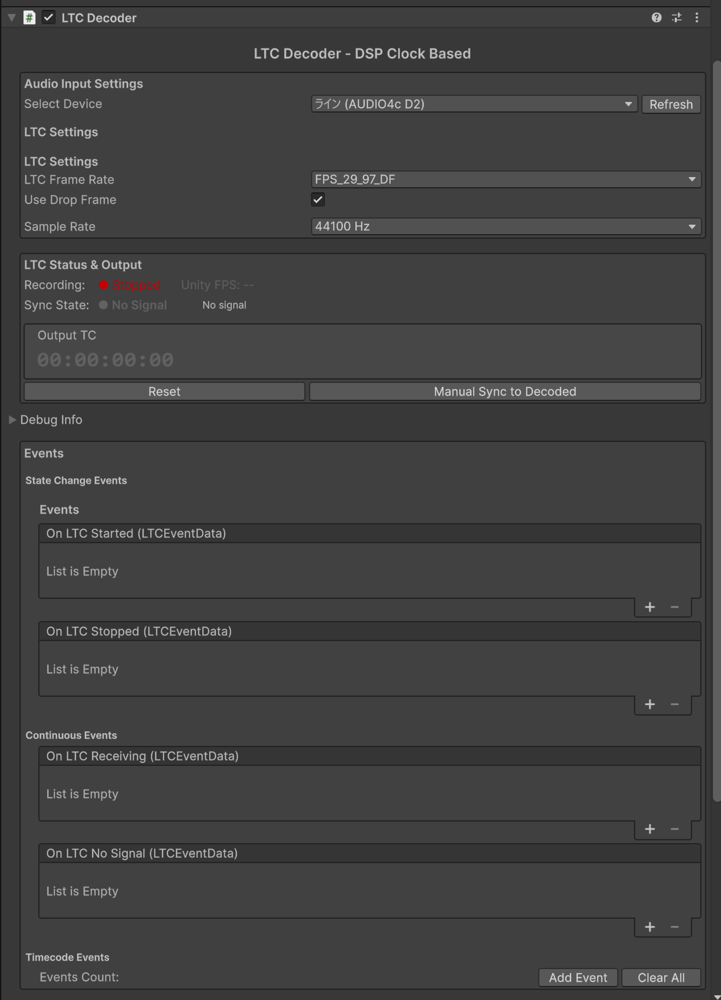
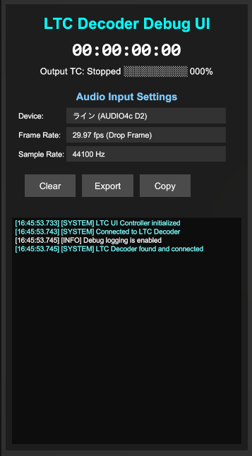

# Unity LTC Timeline Sync

[English Version](README_EN.md)

Unity上でLinear Timecode (LTC/業務用音響・映像機器で使用される同期用タイムコード信号)をリアルタイムデコードし、Unity Timelineと同期させるためのパッケージです。オーディオ入力からLTC信号を解析し、PlayableDirector（Unity Timelineを再生するコンポーネント）を自動的に同期させます。



## ✨ 主な機能

- 🎙️ **リアルタイムLTCデコード** - マイク入力からLTC信号を解析します
- 🎬 **Unity Timeline自動同期** - PlayableDirectorとの高精度同期を実現します
- 🔧 **高度なノイズ除去** - 適応フィルタリングによりジッター（タイムコードの不規則な揺らぎ）を除去します
- 📊 **包括的なデバッグツール** - 波形表示、ジッター解析、詳細ログを提供します
- 🎮 **柔軟なイベントシステム** - UnityEventによる拡張性の高い連携が可能です
- 🖥️ **デバッグUI** - リアルタイムタイムコード表示とステータスモニターを備えています



## 📦 インストール

### Unity Package Manager経由

1. Unity Package Managerを開いてください (Window > Package Manager)
2. 「+」ボタンから「Add package from git URL...」を選択してください
3. 以下のURLを入力してください:
```
https://github.com/iridescent-jp/Unity_LTCDecoder.git?path=jp.iridescent.ltcdecoder
```

### 手動インストール

1. このリポジトリをクローンしてください
2. `jp.iridescent.ltcdecoder`フォルダをプロジェクトの`Packages`フォルダにコピーしてください

## 🚀 クイックスタート

### 基本セットアップ

1. **LTC Decoderを追加**
   - GameObjectに`LTCDecoder`コンポーネントを追加してください
   - Inspectorでオーディオ入力デバイスを選択してください

2. **Timeline同期を設定**
   - PlayableDirectorを持つGameObjectに`LTCTimelineSync`コンポーネントを追加してください
   - LTC Decoderコンポーネントへの参照を設定してください

3. **再生**
   - Playモードを開始してください
   - LTC信号ソースを起動してください

### メニューからの簡単セットアップ

**基本セットアップ**: `GameObject > LTC Decoder > Create LTC Decoder`

**デバッグUI付きセットアップ**: `GameObject > LTC Decoder > Create Complete UI Setup`

## ⚙️ コンポーネント詳細

### LTCDecoder

メインのLTCデコードコンポーネントです。オーディオ入力からLTC信号を解析します。

**主要設定**:
- `Device`: オーディオ入力デバイス
- `Frame Rate`: タイムコードフレームレート (24/25/29.97/30 fps)
- `Drop Frame`: ドロップフレームタイムコード使用
- `Sample Rate`: オーディオサンプリングレート

**ノイズ除去設定**:
- `Use Timecode Validation`: タイムコード連続性チェックを有効化します
- `Jitter Threshold`: ジッター検出閾値（タイムコードのずれを異常と判定する基準値）です (デフォルト: 100ms)
- `Denoising Strength`: ノイズ除去の強度を設定します 0-1 (デフォルト: 0.8)

### LTCTimelineSync

Unity TimelineをデコードされたLTCと同期させるコンポーネントです。

**同期設定**:
- `Sync Threshold`: 同期トリガー閾値です (デフォルト: 0.1秒)
- `Smoothing Factor`: タイムライン調整の滑らかさを設定します (0-1)
- `Pause When No Signal`: LTC信号喪失時に自動一時停止を行います

### LTCEventDebugger

イベントシステムのデバッグとモニタリング用コンポーネントです。

**イベント**:
- `OnTimecodeReceived`: タイムコード受信時
- `OnTimecodeJump`: タイムコードジャンプ検出時
- `OnSignalLost`: LTC信号喪失時
- `OnSignalRestored`: LTC信号復旧時

## 🔍 トラブルシューティング

### タイムコードが表示されない
1. オーディオ入力デバイスが正しく選択されているか確認してください
2. LTC信号が入力されているか確認してください
3. フレームレートとドロップフレーム設定を確認してください

### タイムコードが不安定
1. `Jitter Threshold`を上げてください（安定した信号なら0.05、不安定な信号なら0.15程度）
2. `Denoising Strength`を上げてください（0.5から1.0の範囲で調整）
3. `Min Consecutive Valid Frames`（有効と判定するための連続フレーム数）を増やしてください（2から4の範囲）

### Timeline同期が動作しない
1. PlayableDirectorが正しく設定されているか確認してください
2. `Sync Threshold`を調整してください
3. TimelineAssetが設定されているか確認してください

## 📊 パフォーマンス最適化

### ログ設定
- `Log To Console`は**必ずOFF**にしてください（大きなパフォーマンス影響があります）
- 必要な時のみ特定のログカテゴリを有効化してください
- Inspector内のDebug Logsセクションでログを確認してください

### バッファサイズ
- レイテンシと安定性のトレードオフを考慮してください
- 推奨値は512-1024サンプルです

## 🛠️ 開発者向け情報

### ビルド設定
- 各プラットフォームでマイクロフォン権限の設定が必要です
  - Windows/macOS: 初回起動時にマイクアクセス許可のダイアログが表示されます
  - iOS: Info.plistに`NSMicrophoneUsageDescription`を追加してください
  - Android: AndroidManifest.xmlに`RECORD_AUDIO`権限を追加してください
- サンプルレートは使用するオーディオインターフェースやLTC機器の仕様に合わせて設定してください（一般的には48000Hz、場合により44100Hz）
- 各プラットフォーム固有の設定については、Unity公式ドキュメントを参照してください

### 拡張開発
新機能追加時の注意点:
1. `ValidateTimecode`ロジックへの影響を確認してください
2. 安定した信号と不安定な信号の両方でテストしてください
3. ログがパフォーマンスに影響しないことを確認してください
4. このドキュメントを更新してください

## 📋 動作環境

- Unity 2021.3 LTS以降
- Windows / macOS / Linux
- マイクロフォン入力デバイス

## 📄 ライセンス

MIT License

## 🤝 コントリビューション

Issue報告やPull Requestは[GitHubリポジトリ](https://github.com/iridescent-jp/Unity_LTCDecoder)にお願いします。

## 📝 更新履歴

### v1.2.0 (2025-08-31)
- 外部制御API拡充
- PlayableDirector参照の柔軟化
- Inspector自動更新機能
- 設定永続化システム改善

### v1.1.0 (2025-08-30)
- Unity Package Manager対応
- イベントシステム再設計
- デバッグUI改善

### v1.0.0
- 初回リリース
- 基本的なLTCデコード機能
- Timeline同期機能

---

開発元: [Iridescent](https://iridescent.jp)