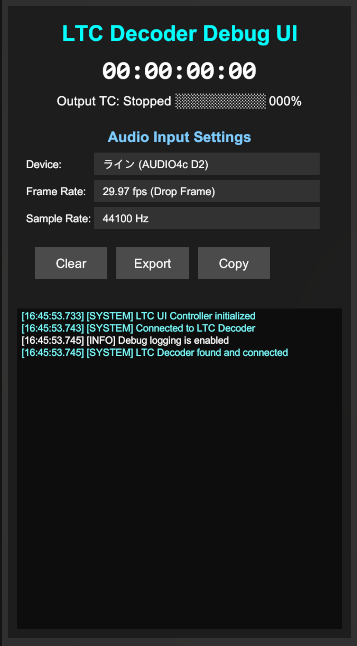
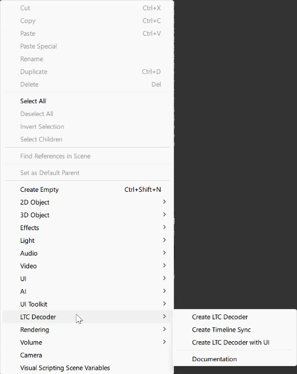

# Unity LTC Decoder

[日本語版](README.md)

A Unity package for real-time Linear Timecode (LTC - synchronization timecode signal used in professional audio/video equipment) decoding. This package analyzes LTC signals from audio input and provides accurate timecode data.

Additionally, it offers Unity Timeline synchronization functionality. By using the LTC Timeline Sync component, you can automatically synchronize PlayableDirector (Unity Timeline playback component) with the decoded LTC.


## ✨ Key Features

- 🎙️ **Real-time LTC Decoding** - Analyzes LTC signals from microphone input
- 🎬 **Unity Timeline Auto-sync** - Provides high-precision synchronization with PlayableDirector
- 🔧 **Advanced Noise Filtering** - Removes jitter (irregular timecode fluctuations) with adaptive filtering
- 📊 **Comprehensive Debug Tools** - Provides waveform display, jitter analysis, and detailed logging
- 🎮 **Flexible Event System** - Enables extensible integration via UnityEvents
- 🖥️ **Debug UI** - Features real-time timecode display and status monitoring



## 📦 Installation

### Via Unity Package Manager

1. Please open Unity Package Manager (Window > Package Manager)
2. Please click "+" button and select "Add package from git URL..."
3. Please enter the following URL:
```
https://github.com/murasaqi/Unity_LTCDecoder.git?path=jp.iridescent.ltcdecoder
```

### Manual Installation

1. Please clone this repository
2. Please copy the `jp.iridescent.ltcdecoder` folder to your project's `Packages` folder

## 🚀 Quick Start

### Basic Setup

1. **Add LTC Decoder**
   - Please add `LTCDecoder` component to a GameObject
   - Please select audio input device in Inspector

2. **Configure Timeline Sync**
   - Please add `LTCTimelineSync` component to GameObject with PlayableDirector
   - Please set reference to LTC Decoder component

3. **Test Operation**
   - Please start Unity Play mode
   - Please input LTC signal from your LTC generator or audio equipment

### Easy Setup from Menu

You can easily set up from Unity menu.



**Basic Setup**: `GameObject > LTC Decoder > Create LTC Decoder`

**Setup with Debug UI**: `GameObject > LTC Decoder > Create Complete UI Setup`

## ⚙️ Component Details

### LTCDecoder

This is the main LTC decoding component. It analyzes LTC signals from audio input.

**Main Settings**:
- `Device`: Audio input device
- `Frame Rate`: Timecode frame rate (24/25/29.97/30 fps)
- `Drop Frame`: Use drop-frame timecode
- `Sample Rate`: Audio sampling rate

**Noise Filtering Settings**:
- `Use Timecode Validation`: Enables timecode continuity checking
- `Jitter Threshold`: Detection threshold for determining timecode deviation as abnormal (default: 100ms)
- `Denoising Strength`: Sets noise removal strength 0-1 (default: 0.8)

### LTCTimelineSync

This component synchronizes Unity Timeline with decoded LTC.


**Sync Settings**:
- `Sync Threshold`: This is the sync trigger threshold (default: 0.1s)
- `Smoothing Factor`: Sets timeline adjustment smoothness (0-1)
- `Pause When No Signal`: Automatically pauses timeline when LTC signal is lost

### LTCEventDebugger

This component is for debugging and monitoring the event system.

**Events**:
- `OnTimecodeReceived`: When timecode is received
- `OnTimecodeJump`: When timecode jump is detected
- `OnSignalLost`: When LTC signal is lost
- `OnSignalRestored`: When LTC signal is restored

## 🔍 Troubleshooting

### No Timecode Display
1. Please check if audio input device is correctly selected
2. Please verify LTC signal is being input
3. Please check frame rate and drop frame settings

### Unstable Timecode
1. Please increase `Jitter Threshold` (around 0.05 for stable signals, 0.15 for unstable signals)
2. Please increase `Denoising Strength` (adjust within 0.5 to 1.0 range)
3. Please increase `Min Consecutive Valid Frames` (number of consecutive frames required for validation, range 2-4)

### Timeline Sync Not Working
1. Please check if PlayableDirector is correctly configured
2. Please adjust `Sync Threshold`
3. Please verify TimelineAsset is set

## 📊 Performance Optimization

### Log Settings
- **Always keep** `Log To Console` **OFF** (this has major performance impact)
- Please enable specific log categories only when needed
- Please check logs in Inspector's Debug Logs section

### Buffer Size
- Please consider the trade-off between latency and stability
- Recommended value is 512-1024 samples

## 🛠️ Developer Information

### Build Settings
- Microphone permissions are required for each platform:
  - Windows/macOS: A microphone access permission dialog will appear on first launch
  - iOS: Please add `NSMicrophoneUsageDescription` to Info.plist
  - Android: Please add `RECORD_AUDIO` permission to AndroidManifest.xml
- Please set the sample rate according to your audio interface and LTC equipment specifications (typically 48000Hz, sometimes 44100Hz)
- Please refer to Unity official documentation for platform-specific settings

### Extension Development
When adding new features:
1. Please check impact on `ValidateTimecode` logic
2. Please test with both stable and unstable signal sources
3. Please ensure logging doesn't impact performance
4. Please update this documentation

## 📋 Requirements

- Unity 2021.3 LTS or later
- Windows / macOS / Linux
- Microphone input device

## 📄 License

MIT License

## 🤝 Contributing

Please submit issues and pull requests to the [GitHub repository](https://github.com/murasaqi/Unity_LTCDecoder).

## 📝 Version History

### v1.2.0 (2025-08-31)
- Enhanced external control API
- Flexible PlayableDirector reference
- Automatic Inspector update
- Improved settings persistence system

### v1.1.0 (2025-08-30)
- Unity Package Manager support
- Event system redesign
- Debug UI improvements

### v1.0.0
- Initial release
- Basic LTC decoding functionality
- Timeline synchronization

---

Developed by [Iridescent](https://iridescent.jp)